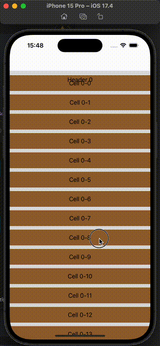
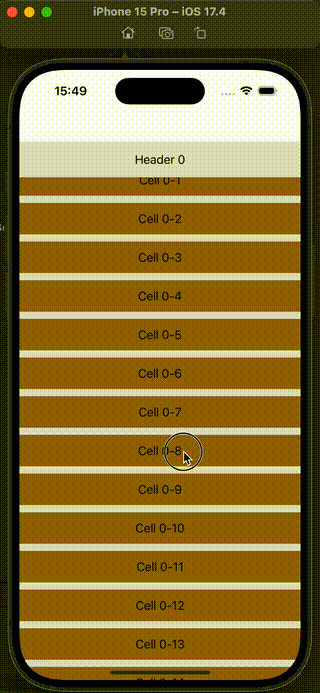

在使用 UICollectionViewFlowLayout 并且开启 header 吸附时，如果 header 的背景是透明的，会出现 header 跟 cell 重叠的现象，这个项目尝试解决这个问题  

| 问题 | 修复后 |
| - | - |
|  |  |

---  

* [Github](https://github.com/568071718/clip-header-overlap)    
* [Gitee](https://gitee.com/568071718/clip-header-overlap)  

## 集成  

* CocoaPods  
```ruby
# 以下源选择一个配置到项目 Podfile 文件，执行 pod install  

# Github  
pod 'clip-header-overlap', :git => 'https://github.com/568071718/clip-header-overlap.git'  

# Gitee  
pod 'clip-header-overlap', :git => 'https://gitee.com/568071718/clip-header-overlap.git'  
```

## UICollectionView  

在 scrollViewDidScroll 和 willDisplayCell 里面执行 YXClipHeaderOverlap 提供的方法  
```swift
func scrollViewDidScroll(_ scrollView: UIScrollView) {
    YXClipHeaderOverlap.adjustCellMaskForHeaderOverlap(withListView: scrollView)
}
func collectionView(_ collectionView: UICollectionView, willDisplay cell: UICollectionViewCell, forItemAt indexPath: IndexPath) {
    YXClipHeaderOverlap.adjustCellMaskForHeaderOverlap(withListView: collectionView, willDisplayCell: cell)
}
```  

在搭配 MJRefresh 实现刷新时，由于 `endRefreshing` 有一个回弹过程，可能会出现错误裁剪(cell 丢失，数据显示不全)的情况，解决方案是在 MJ 结束刷新后再执行一次裁剪方法  

```swift
if let header = collectionView.mj_header {
    header.endRefreshingCompletionBlock = { [weak self] in
        guard let self = self else { return }
        YXClipHeaderOverlap.adjustCellMaskForHeaderOverlap(withListView: collectionView)
    }
}
```

## UITableView  

UITableView 似乎只需要在 scrollViewDidScroll 里面执行裁剪业务就好   

```swift
func scrollViewDidScroll(_ scrollView: UIScrollView) {
    YXClipHeaderOverlap.adjustCellMaskForHeaderOverlap(withListView: scrollView)
}
```

有碰到其他问题参考上面 UICollectionView 的解决方案  


